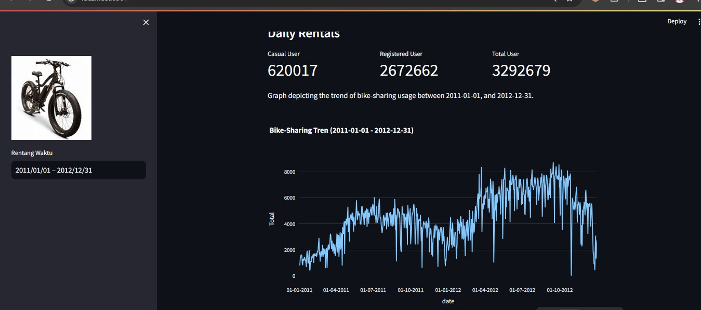

# Submission Dicoding "Belajar Analisis Data dengan Python"<br>
This is the final project from Dicoding, which is data analysis with Python using bike-sharing.

## Preview
<p align="center">
  
## File Structures
```

├── dashboard
│   ├── bike.jpeg
│   ├── dashboard.py
│   ├── day.csv
│   └── hour.csv
├── data
│   ├── day.csv
|   └── hour.csv
├── ss.jpeg
├── README.md
├── Proyek_Analisis_Data.ipynb
├── url.txt
└── requirements.txt
```

## Project work flow
1. Data Wrangling: 
 - Gathering data
 - Assessing data
 - Cleaning data
2. EDA:
 - Defined business questions for data exploration
 - Create Data exploration
3. Data Visualization:
 - Create Data Visualization that answer business questions
4. Dashboard:
 - Make filter components on the dashboard
 - Complete the dashboard with various data visualizations

## Instalation

1. .ipynb
    -Download this project on your computer .
    -Open your IDE like Google Colaboratory on your computer.
    -Create a New Notebook and upload this file.
    -Connect to hosted runtime.
    -and run.
2. dashboard.py
    - download this project and run this code on your cmd for your requirement

    ```shell
    pip install streamlit
    pip install -r requirements.txt
    ```
    run this code for dashboard
    ```shell
    streamlit run dashboard_bike.py
